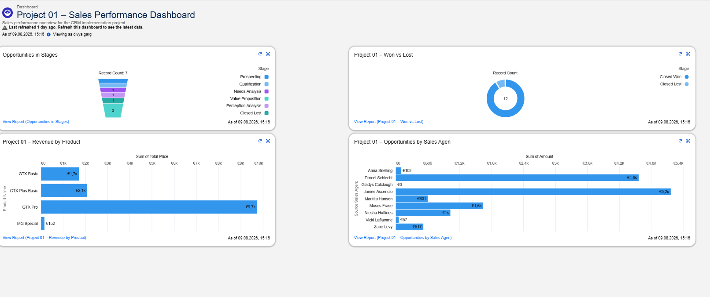
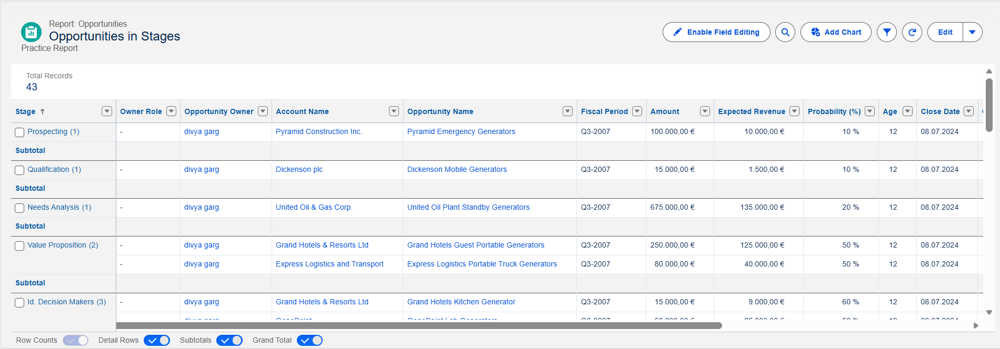
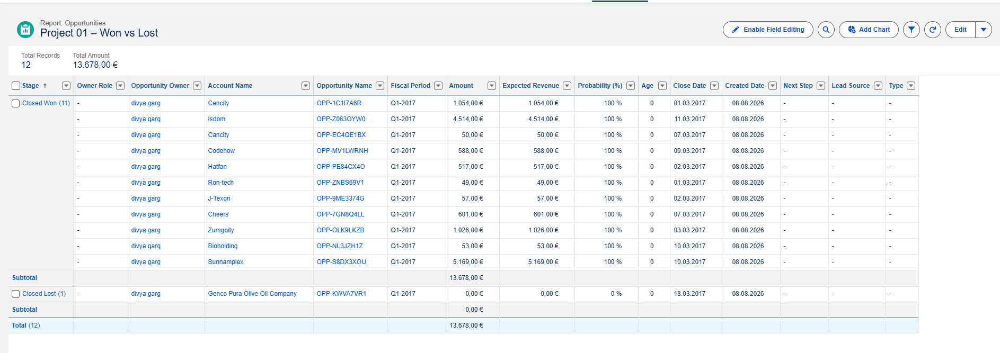
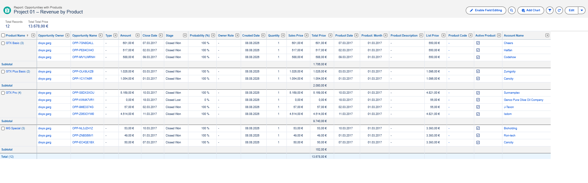
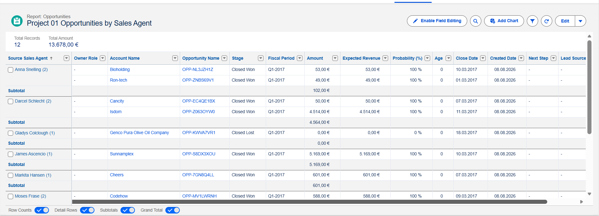

# Salesforce CRM Implementation

## Project Overview

A self-directed Salesforce CRM implementation project focused on managing customer and sales data, improving visibility into the opportunity pipeline, and creating reporting and dashboard views for sales performance analysis.

## Business Objective

Build a structured CRM solution that supports:

- Customer and sales data management
- Opportunity pipeline visibility
- Data organisation and mapping
- Sales reporting
- Performance analysis through dashboards

## Project Structure

### 01 – Business Requirements
Defined the project objective, business requirements, CRM scope, and expected outcomes.

### 02 – Data Discovery
Reviewed the available sales data and identified the key information required for CRM implementation and reporting.

### 03 – Data Mapping
Mapped source sales data to appropriate Salesforce objects and fields to support consistent CRM data management.

### 04 – Salesforce Configuration
Configured the Salesforce CRM environment and structured the required CRM objects and fields.

### 05 – Reports
Created reports to analyse:

- Opportunities by Stage
- Won vs Lost Opportunities
- Revenue by Product
- Opportunities by Sales Agent

### 06 – Dashboard
Created a Sales Performance Dashboard combining key CRM metrics and report views.

## Dashboard

The Sales Performance Dashboard provides a consolidated view of:

- Opportunity pipeline by stage
- Won vs Lost opportunities
- Revenue by product
- Opportunities by sales agent

## Reports

### Opportunities by Stage

### Won vs Lost

### Revenue by Product

### Opportunities by Sales Agent

## Skills Demonstrated

- CRM implementation
- Salesforce configuration
- Data discovery
- Data mapping
- CRM reporting
- Dashboard development
- Sales pipeline analysis
- Business requirements documentation
- Data-driven decision support

## Tools

- Salesforce
- GitHub
- Markdown

## Project Type

Self-directed / Portfolio Project
